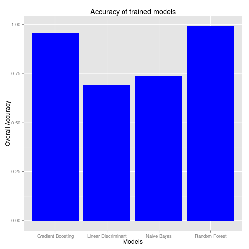

# By Jing Guo.        
    
This is an analysis report for course project of practical machine learning. The aim of this project is building a machine learning model by using the data collectted from from accelerometers on the belt, forearm, arm, and dumbell of 6 participants to accurately predict which tpye of activity they were doing, i.e. the classe variable in the dataset. After training the models, there is test data to perform the most accurate model which was selected from the data analysis.          
    
## Load and Preprocess the data

The analysis starts with the downloaded data provided from the course website. After checking the data, I found there are three kinds of missing value, "NA", "" and "#DIV/0!".       
The following is the code chunk.        
    

```r
library(caret)
```

```
## Loading required package: lattice
## Loading required package: ggplot2
```

```r
pmlTrain <- read.csv(file = './data/pml-training.csv',na.strings = c('NA','#DIV/0!',''))
pmlTest <- read.csv(file = './data/pml-testing.csv',na.strings = c('NA','#DIV/0!',''))
```
    
After checking the data by function of summary, I noted that the first 7 fields of the data are sample particular information and couldn't contribute to the prediction model. Besides, there are lots of features that include lots of missing value. So I would like to remove these two kinds of columns and use the rest of the fields.   
The following is the code chunk.        
        

```r
for(i in c(8:ncol(pml_train)-1)) {
  pmlTrain[,i] = as.numeric(as.character(pmlTrain[,i]))
  pmlTest[,i] = as.numeric(as.character(pmlTest[,i]))
}
```

```
## Error: object 'pml_train' not found
```

```r
colSelected <- colnames(pmlTrain)
colSelected <- colnames(pmlTrain[colSums(is.na(pmlTrain)) == 0])
colSelected <- colSelected[-c(1:7)]
```

## Split Data into Testing and Cross-Validation datasets
    
To make the analysis reproducible, I set a seed. The testing data is split into 75% of the data for the training sample and 25% of the data for cross-validation. When the samples are created, they are sliced by column against the feature set so only the variables of interest are fed into the final model.   
The following is the code chunk.        


```r
set.seed(2300)
indexTrain <- createDataPartition(y=pmlTrain$classe, p=0.75, list=FALSE)
dataTrain <- pmlTrain[indexTrain,colSelected]
dataCval <- pmlTrain[-indexTrain,colSelected]
dim(dataTrain); dim(dataCval)
```

```
## [1] 14718    53
```

```
## [1] 4904   53
```

## Train Models
    
Four models are trained by the training data and assessed accuracy by the cross-validation data. The models are Random Forest, Gradient Boosting, Lienar Discriminant Analysis, and Naive Bayes.       
The following is the code chunk.        


```r
rfmdl <- train(classe ~ .,data=dataTrain, method='rf', trControl=trainControl(method="cv", number=5, 
                                       allowParallel=TRUE, 
                                       verboseIter=TRUE)) # Random Forrest
gbmmdl <- train(classe ~ ., data=dataTrain, method='gbm', verbose=FALSE,trControl=trainControl(method="cv", number=5, 
                                        allowParallel=TRUE, 
                                        verboseIter=TRUE)) # Gradient Boosting
ldamdl <- train(classe ~ ., data=dataTrain, method='lda',trControl=trainControl(method="cv", number=5, 
                                        allowParallel=TRUE, 
                                        verboseIter=TRUE)) # Linear Discriminant Analysis
nbmdl <- train(classe ~ ., data=dataTrain, method='nb',trControl=trainControl(method="cv", number=5, 
                                        allowParallel=TRUE, 
                                        verboseIter=TRUE)) # Naive Bayes
```

## Predict the classe of cross validation data
    
For every trained model, the classe of cross validation data was predicted and confusion matrixs are calculated as well.    
The following is the code chunk.        


```r
rfPrdt <- predict(rfmdl,dataCval)
rfConMx <- confusionMatrix(rfPrdt,dataCval$classe)

gbmPrdt <- predict(gbmmdl,dataCval)
gbmConMx <- confusionMatrix(gbmPrdt,dataCval$classe)

ldaPrdt <- predict(ldamdl,dataCval)
ldaConMx <- confusionMatrix(ldaPrdt,dataCval$classe)

nbPrdt <- predict(nbmdl,dataCval)
nbConMx <- confusionMatrix(nbPrdt,dataCval$classe)
```

## Compare the accuracy of models 

I made a plot to compare the overall accuracy of models.        
The following is the code chunk.


```r
modelAccuracy <- data.frame(Models = c('Random Forest','Gradient Boosting','Linear Discriminant','Naive Bayes'),
                            Accuracy = c(rfConMx$overall[1],gbmConMx$overall[1],ldaConMx$overall[1],nbConMx$overall[1]))

ggplot(aes(Models, Accuracy), data=modelAccuracy) +geom_bar(stat='identity',fill = 'blue') +
                            ggtitle('Accuracy of trained models') +xlab('Models') +ylab('Overall Accuracy')
```

 
          
The random forest model turns out to be best. There is a need to show the whole confusion matrixs of it. 


```r
rfConMx
```

```
## Confusion Matrix and Statistics
## 
##           Reference
## Prediction    A    B    C    D    E
##          A 1395    9    0    0    0
##          B    0  938    3    0    0
##          C    0    2  849    5    4
##          D    0    0    3  799    6
##          E    0    0    0    0  891
## 
## Overall Statistics
##                                         
##                Accuracy : 0.993         
##                  95% CI : (0.991, 0.996)
##     No Information Rate : 0.284         
##     P-Value [Acc > NIR] : <2e-16        
##                                         
##                   Kappa : 0.992         
##  Mcnemar's Test P-Value : NA            
## 
## Statistics by Class:
## 
##                      Class: A Class: B Class: C Class: D Class: E
## Sensitivity             1.000    0.988    0.993    0.994    0.989
## Specificity             0.997    0.999    0.997    0.998    1.000
## Pos Pred Value          0.994    0.997    0.987    0.989    1.000
## Neg Pred Value          1.000    0.997    0.999    0.999    0.998
## Prevalence              0.284    0.194    0.174    0.164    0.184
## Detection Rate          0.284    0.191    0.173    0.163    0.182
## Detection Prevalence    0.286    0.192    0.175    0.165    0.182
## Balanced Accuracy       0.999    0.994    0.995    0.996    0.994
```

```r
rfAccuracy<-rfConMx$overall[1]
outSampleError<-1-rfConMx$overall[1]
```

The overall accuracy of the random forest is 0.9935. So, the out of sample error is 0.0065. There are only 20 samples to be predict, we can expect that most or all of the test samples would be properly classified.    
    
## Predict the classe of real testing data 

Using the well-trained random forest model, we can get the prediction of the classe of real testing data. When I carried out the prediction, I found that the final column name in testing data is different from the training data. So, I just changed it in case of any error.            
The following is the code chunk.
    

```r
lastCol <- length(colnames(pmlTest))
colnames(pmlTest)[lastCol] <- 'classe'
finalResult <- predict(rfmdl,pmlTest[,colSelected])
finalResult
```

```
##  [1] B A B A A E D B A A B C B A E E A B B B
## Levels: A B C D E
```
